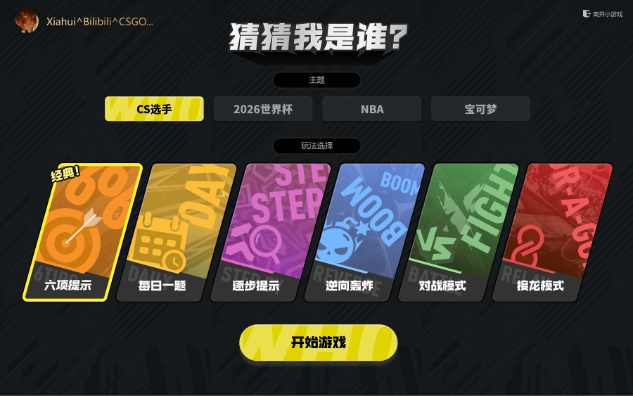
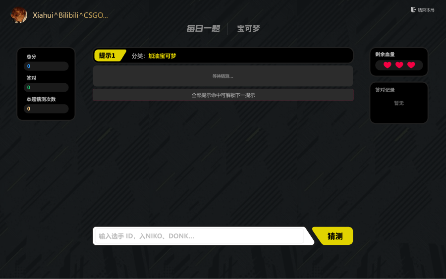
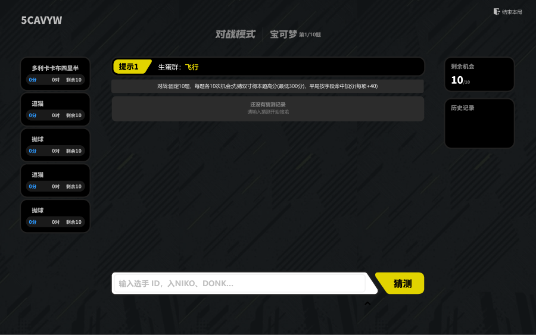
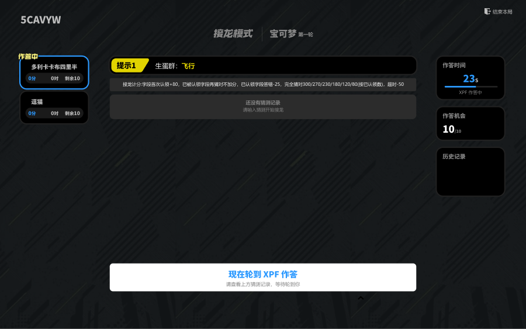
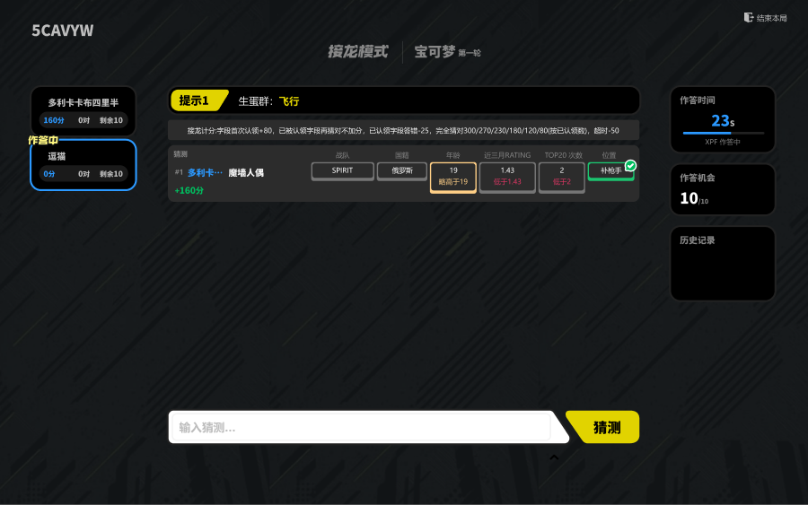

# Guess Who — 界面与状态清单

> 给 **前端开发 + 设计走查**：按用户操作顺序标出**路由、页面组件、界面状态、区域、按钮与关键文案**。  
> **玩法 / 出题 / 提示规则**见上文「游戏设计文档」§一～三（本文不重复规则）。  
> **视觉稿**：Figma「PWA设计最新文件」中的 **「小游戏」** 分区（见下表对照）。

### 用语

| 用语 | 含义 |
|------|------|
| **界面** | 整屏页面（首页、游戏页…） |
| **界面状态** | 同一界面的不同样子（未进房 / 等待中） |
| **区域** | 顶栏、主内容、底栏等固定区块 |
| **弹层** | 确认框、倒计时、揭晓答案等浮层 |

### 前端路由 ↔ 页面组件

| 路由 | 组件 | 对应界面 |
|------|------|----------|
| `/` | `HomePage` | 首页（主题 + 玩法选择） |
| `/game` | `GamePage` | 单人游戏页 |
| `/result` | `ResultPage` | 单人结算页 |
| `/lobby` | `LobbyPage` | 多人大厅（未进房 / 等待 / 邀请） |
| `/multiplayer` | `MultiplayerGamePage` | 多人对局页 |
| `/settlement` | `SettlementPage` | 多人结算页 |
| `/leaderboard` | `LeaderboardPage` | 排行榜页 |
| （全局浮层） | `GlobalLobbyCountdown` → `LobbyCountdown` | 开局 3-2-1（任意路由可盖住） |

Socket 房间态在 `GameRoomProvider`（`useGameRoom`）；多人结算缓存键：`sessionStorage['guess-who-last-room']`。

### Figma「小游戏」分区 ↔ 实现对照

稿件总览：[PWA设计最新文件 · 画布 `1:249`](https://www.figma.com/design/rq2qU0Z6rNG97H4xz1xioU/PWA%E8%AE%BE%E8%AE%A1%E6%9C%80%E6%96%B0%E6%96%87%E4%BB%B6-2023-2025?node-id=1-249&t=sFIYEXv8C2gVr1Vv-0)  
分区标题图层：**`小游戏`**（node-id `39453:4641`）→ [打开分区标题](https://www.figma.com/design/rq2qU0Z6rNG97H4xz1xioU/PWA%E8%AE%BE%E8%AE%A1%E6%9C%80%E6%96%B0%E6%96%87%E4%BB%B6-2023-2025?node-id=39453-4641&t=sFIYEXv8C2gVr1Vv-0)

> **怎么一键定位**：点表中「打开」会跳到 Figma 对应 Frame。Wiki 本页在两段 MD 之间另有**截图画廊**（附件），可直接对照模块。

| 图层名（Frame） | node-id | 一键打开 | 路由 / 组件 | 说明 |
|-----------------|---------|----------|-------------|------|
| **`Frame 987（玩法/主题选择）`** | `39521:2246` | [打开](https://www.figma.com/design/rq2qU0Z6rNG97H4xz1xioU/PWA%E8%AE%BE%E8%AE%A1%E6%9C%80%E6%96%B0%E6%96%87%E4%BB%B6-2023-2025?node-id=39521-2246&t=sFIYEXv8C2gVr1Vv-0) | / · HomePage | 小游戏首页：主题 + 玩法卡（每日/逐步/轰炸/对战/接龙） |
| **`逐步`** | `39544:2617` | [打开](https://www.figma.com/design/rq2qU0Z6rNG97H4xz1xioU/PWA%E8%AE%BE%E8%AE%A1%E6%9C%80%E6%96%B0%E6%96%87%E4%BB%B6-2023-2025?node-id=39544-2617&t=sFIYEXv8C2gVr1Vv-0) | /game · GamePage（逐步） | 逐步提示对局：无对比格、心形命数、提示区 |
| **`对战`** | `39571:7195` | [打开](https://www.figma.com/design/rq2qU0Z6rNG97H4xz1xioU/PWA%E8%AE%BE%E8%AE%A1%E6%9C%80%E6%96%B0%E6%96%87%E4%BB%B6-2023-2025?node-id=39571-7195&t=sFIYEXv8C2gVr1Vv-0) | /multiplayer · MultiplayerGamePage（对战） | 对战进行中：顶栏进度、提示、猜测列表、猜测按钮 |
| **`接龙-开始`** | `39594:2766` | [打开](https://www.figma.com/design/rq2qU0Z6rNG97H4xz1xioU/PWA%E8%AE%BE%E8%AE%A1%E6%9C%80%E6%96%B0%E6%96%87%E4%BB%B6-2023-2025?node-id=39594-2766&t=sFIYEXv8C2gVr1Vv-0) | /multiplayer · 接龙空记录 | 接龙本题开始：还没有猜测记录 |
| **`接龙-轮流答题`** | `39596:2851` | [打开](https://www.figma.com/design/rq2qU0Z6rNG97H4xz1xioU/PWA%E8%AE%BE%E8%AE%A1%E6%9C%80%E6%96%B0%E6%96%87%E4%BB%B6-2023-2025?node-id=39596-2851&t=sFIYEXv8C2gVr1Vv-0) | /multiplayer · 接龙等待回合 | 接龙轮到他人：底栏等待文案 + 回合倒计时 |
| **`接龙-扣分`** | `39653:2570` | [打开](https://www.figma.com/design/rq2qU0Z6rNG97H4xz1xioU/PWA%E8%AE%BE%E8%AE%A1%E6%9C%80%E6%96%B0%E6%96%87%E4%BB%B6-2023-2025?node-id=39653-2570&t=sFIYEXv8C2gVr1Vv-0) | `/multiplayer` | 接龙扣分反馈 |
| **`接龙-猜中`** | `39653:2764` | [打开](https://www.figma.com/design/rq2qU0Z6rNG97H4xz1xioU/PWA%E8%AE%BE%E8%AE%A1%E6%9C%80%E6%96%B0%E6%96%87%E4%BB%B6-2023-2025?node-id=39653-2764&t=sFIYEXv8C2gVr1Vv-0) | `/multiplayer` | 接龙猜中反馈 |
| **`接龙-次数用尽`** | `39663:4910` | [打开](https://www.figma.com/design/rq2qU0Z6rNG97H4xz1xioU/PWA%E8%AE%BE%E8%AE%A1%E6%9C%80%E6%96%B0%E6%96%87%E4%BB%B6-2023-2025?node-id=39663-4910&t=sFIYEXv8C2gVr1Vv-0) | 弹层 `RelayOpponentExhaustedModal` | 对手机会用尽 |

```
平台壳（Figma 其它分区）
└── 小游戏（图层名「小游戏」）
    ├── Frame 987 / 玩法选择     →  /  HomePage
    ├── 逐步                     →  /game  GamePage
    ├── 对战                     →  /multiplayer  对战
    └── 接龙-*                   →  /multiplayer  接龙各状态
```

#### 关键帧截图（仓库内预览）

> Wiki 页在两段 MD 之间另有同套附件画廊。本地预览用 `docs/figma-refs/`。

**`Frame 987（玩法/主题选择）`** · [`39521:2246` 打开](https://www.figma.com/design/rq2qU0Z6rNG97H4xz1xioU/PWA%E8%AE%BE%E8%AE%A1%E6%9C%80%E6%96%B0%E6%96%87%E4%BB%B6-2023-2025?node-id=39521-2246)



**`逐步`** · [`39544:2617` 打开](https://www.figma.com/design/rq2qU0Z6rNG97H4xz1xioU/PWA%E8%AE%BE%E8%AE%A1%E6%9C%80%E6%96%B0%E6%96%87%E4%BB%B6-2023-2025?node-id=39544-2617)



**`对战`** · [`39571:7195` 打开](https://www.figma.com/design/rq2qU0Z6rNG97H4xz1xioU/PWA%E8%AE%BE%E8%AE%A1%E6%9C%80%E6%96%B0%E6%96%87%E4%BB%B6-2023-2025?node-id=39571-7195)



**`接龙-开始`** · [`39594:2766` 打开](https://www.figma.com/design/rq2qU0Z6rNG97H4xz1xioU/PWA%E8%AE%BE%E8%AE%A1%E6%9C%80%E6%96%B0%E6%96%87%E4%BB%B6-2023-2025?node-id=39594-2766)



**`接龙-轮流答题`** · [`39596:2851` 打开](https://www.figma.com/design/rq2qU0Z6rNG97H4xz1xioU/PWA%E8%AE%BE%E8%AE%A1%E6%9C%80%E6%96%B0%E6%96%87%E4%BB%B6-2023-2025?node-id=39596-2851)



### 界面总览

```
首页
├── 单人玩法 ──→ 单人游戏页 ──→ 单人结算页 ──→ 首页
├── 多人玩法 ──→ 多人大厅 ──→ 多人对局页 ──→ 多人结算页 ──→ 首页
└── 另可进入 ──→ 排行榜页 ──→ 首页
```

| 界面名称 | 什么时候出现 |
|----------|--------------|
| 首页 | 打开游戏；或从各界面点「返回首页」 |
| 单人游戏页 | 首页选了经典 / 每日 / 逐步 / 逆向并开始 |
| 单人结算页 | 单人一局结束或主动结束 |
| 多人大厅 | 首页选了对战 / 接龙；或通过邀请链接进来 |
| 多人对局页 | 大厅里房主点开始，倒计时结束后 |
| 多人结算页 | 正常打完 / **任一玩家退出或断线**（倒计时中或对局中）/ 自己点「退出」 |
| 排行榜页 | 首页点「查看排行榜」 |

### 前端关键文案（实现侧）

| 出现位置 | 文案 | 备注 |
|----------|------|------|
| 提示卡 · label | `属性相克` | `weaknessHint` |
| 提示卡 · value | `受到{属性}属性攻击 *2` / `*4` / `*1/2` / `*1/4` / `无效` | 多条并排不互相覆盖 |
| 提示卡 · 小标题 | 首条「提示」；追加「追加」；招式「招式」 | `HintCard` |
| 多人空猜测区 | 「还没有猜测记录」+ 副文案 | 题间：「本题已结束，请等待下一题」；接龙未轮到：「等待 {昵称} 作答」 |
| 接龙底栏等待 | 「现在轮到 {昵称} 作答」/「你的机会已用尽，等待对方作答」 | |
| 题间倒计时 | 「等待下一题」+ 大号秒数 | `BattleNextCountdown` |
| 开局倒计时 | 「游戏即将开始」+ 3/2/1 | `LobbyCountdown` |
| 多人结算标题 | 「本局结算」 | `finishReason` 如「十道题已完成」「某某 已退出」 |
| Toast | 「题库中没有该角色」 | 不扣机会 |

---

## 公共入口

> 所有模式都会经过首页；排行榜为可选入口。

### 首页 · 默认状态

**所在界面**：首页  
**界面状态**：默认  
**路由**：`/` · `HomePage`

```
首页
├── 标题区
│   ├── 主标题「Guess Who」（稿面常见「猜猜我是谁？」）
│   └── 副标题「猜人物 · 比线索 · 争高分」
├── 填写区
│   ├── 昵称输入框              【必填，最多 20 字】
│   ├── 玩法选择（6 个选项）    【只能选一个，选中项蓝框高亮】
│   └── 主题选择（4 个选项）    【只能选一个，两行两列排列】
├── 操作区
│   ├── 主按钮                  【文字随所选玩法变化，见下一节】
│   └── 次按钮「查看排行榜」      【始终可点，进入排行榜页】
└── 提示区
    └── 错误提示（红字）        【仅未填昵称等校验失败时出现】
```

### 首页 · 点主按钮

**所在界面**：首页  
**界面状态**：由所选玩法决定主按钮文字，以及点完后去哪个界面

| 所选玩法 | 主按钮上显示 | 点完后进入 |
|----------|--------------|------------|
| 经典 / 逐步 / 逆向 | 开始游戏 | 单人游戏页 |
| 每日一题 · 今天还没玩 | 开始游戏 | 单人游戏页 |
| 每日一题 · 玩了一半 | 继续今日挑战 | 单人游戏页 |
| 每日一题 · 今天已玩完 | 查看今日成绩 | 单人结算页 |
| 对战 / 接龙 | 进入房间 | 多人大厅（创建/加入房间，见 [多人大厅 · 大厅外](#多人大厅--大厅外)） |
| 从邀请链接进来 | 加入房间 {房间号} | 多人大厅 |
| 正在加载 | 准备中... | 【按钮置灰，不可点】 |

**主按钮状态说明**

| 情况 | 按钮表现 |
|------|----------|
| 没填昵称 | 能点，但点后会出红字提示 |
| 正在加载 | 置灰不可点 |
| 每日已玩完 | 文字变成「查看今日成绩」 |

### 排行榜页

**所在界面**：排行榜页  
**界面状态**：加载中 → 有数据 / 暂无数据

```
排行榜页
├── 顶栏
│   ├── 标题「排行榜」
│   └── 按钮「返回首页」
├── 筛选区
│   ├── 玩法下拉（四种单人玩法）
│   └── 主题下拉（四个主题）
└── 列表区
    ├── 加载中                显示「加载中...」
    ├── 暂无数据              显示「暂无记录，快来挑战吧！」
    └── 有数据                表格列表（每日榜显示轮次、耗时；其他榜显示分数、答对数）
```

---

## 单人游戏

> 经典 / 每日 / 逐步 / 逆向 四种玩法共用「单人游戏页」布局；主内容区与底栏随玩法不同。  
> 一局结束后均进入「单人结算页」。

### 单人游戏页 · 进入与布局

**所在界面**：单人游戏页  
**界面状态**：加载中 → 对局中

```
单人游戏页（共用布局）
├── 【状态：加载中】
│   └── 全屏居中「加载游戏中...」
│
└── 【状态：对局中】
    ├── 顶栏
    │   ├── 左侧：主题名 + 自己的昵称
    │   ├── 中间：（仅逆向轰炸）「第 N / 3 轮」
    │   └── 右侧：按钮「结束本局」     → 弹出「结束本局确认」弹层
    ├── 成绩条
    │   ├── 当前总分、答对题数
    │   └── 剩余机会 或 剩余生命（逐步提示为 3 颗心）
    ├── 主体（宽屏三栏 / 手机单列）
    │   ├── 左侧成绩摘要            【仅宽屏显示】
    │   ├── 中间主内容              【随玩法不同，见下一节】
    │   └── 右侧机会与答对记录      【仅宽屏；手机上收到底部】
    ├── 底部输入区                  【手机固定底栏；宽屏部分在右侧】
    └── 弹层                        【见 [单人游戏 · 弹层](#单人游戏--弹层)】
```

顶栏「结束本局」在对局中始终可点，点了会先出确认框。

### 对局画面 · 按玩法

#### 经典六项 / 每日一题

**界面状态**：本题进行中 → 本题猜对 →（每日）整局结束

```
中间主内容
├── 【本题还在猜】
│   ├── 提示卡片区              【先 1 条提示，猜满 3/6/9 次各多 1 条】
│   ├── 橙色轻提示条            【输入的名字不在题库里】
│   ├── 红色错误条              【网络等错误】
│   └── 猜测记录列表
│       ├── 还没有猜过时        「还没有猜测记录」
│       └── 每次猜测一行        【多列对比：绿=对、黄=接近、红=不对】
│
└── 【本题猜对了】
    └── 绿色恭喜横条              【显示用了几次、得多少分】

底部
├── 【还在猜】
│   ├── 输入框 +「猜测」按钮    【有机会时可输入】
│   └── 机会用完                【输入框置灰】
└── 【本题猜对】
    └── 按钮「下一题 →」          【经典可一直玩；每日猜对后不再出现】
```

| 每日一题与经典的界面差别 | 说明 |
|--------------------------|------|
| 机会上限 | 显示最多 20 次 |
| 猜对之后 | 不出现「下一题」，自动去结算 |
| 结算页 | 一定会展示「今日答案」 |

#### 逐步提示

**界面状态**：对局中（没有对比格）

```
中间主内容
├── 提示列表区                  【一条一条解锁，不能一次看全】
└── 猜测记录                    【每行只显示名字和对错，没有对比格】

成绩条
└── 三颗心                      【整局共用，换题也不补】

底部
└── 输入框 +「猜测」            【命用完则置灰】
```

#### 逆向轰炸

**界面状态**：筛选卡片 → 终极猜测 → 本轮结束

```
中间主内容
├── 【正在筛卡片】
│   └── 约 100 张人物卡片网格   【不符合条件的卡片会播放淘汰动画后消失】
│
└── 【筛选用尽，要猜人】
    └── 只剩下的卡片可点选填入名字

底部
├── 【正在筛卡片】
│   └── 条件选择区              【两个属性里选一个，再设条件，点提交】
├── 【要猜人】
│   └── 输入框                  占位提示「筛选已用尽，输入终极猜测」
└── 【本轮结束】
    └── 按钮「下一题 →」
```

每轮结束会弹出「逆向本轮结果」浮层；三轮都结束后去单人结算页。

### 输入猜测 · 四种共用

**仍在**：单人游戏页  
**用户操作**：打字或选下拉建议 → 点「猜测」

| 结果 | 界面上会看到 | 会不会扣机会 |
|------|--------------|--------------|
| 名字不在题库里 | 中间上方橙色条提示 | 不扣 |
| 猜错了还有机会 | 多一行记录；机会减 1 | 扣 |
| 猜对了 | 恭喜横条；底部变成「下一题」 | 不扣（经典模式会加 2 次机会） |
| 猜错了且没机会/没命了 | 弹出「答案揭晓」弹层 | — |

### 单人游戏 · 弹层

| 名称 | 什么时候出现 | 里面有什么 | 底部按钮 |
|------|--------------|------------|----------|
| 结束本局确认 | 点顶栏「结束本局」 | 说明当前成绩会保存 | 「继续」/ 红色「结束本局」→ 去结算 |
| 逆向本轮结果 | 逆向轰炸每一轮结束 | 正确答案头像名字、本轮得分、成功或失败 | 「下一题」或「查看结算」 |
| 答案揭晓 | 机会或生命用完还没猜对 | 正确答案展示 | 「查看结算」→ 去结算 |

### 单人结算页

**所在界面**：单人结算页  
**界面状态**：随玩法和结束方式，标题和数字区不同

```
单人结算页
├── 成绩大卡
│   ├── 顶部表情                  正常结束 / 中途退出
│   ├── 大标题                    【见下表】
│   ├── 答案展示卡                【需要揭晓答案时出现】
│   ├── 成绩数字区                【两列数字 或 逆向三轮小卡】
│   └── 按钮「回到首页」
└── 排行榜区块
    ├── 小标题（随玩法命名）
    └── 前 15 名列表              【自己那一行高亮】
```

| 结束方式 | 大标题示例 |
|----------|------------|
| 正常玩完 | 游戏结束 / 今日挑战完成 / 三轮挑战完成 |
| 每日没猜对 | 挑战失败 |
| 自己点结束 | 已退出游戏 |

---

## 多人游戏

> 对战和接龙共用「多人大厅」和「多人对局页」；中间玩法细节不同。

### 多人大厅 · 大厅外

**所在界面**：多人大厅  
**界面状态**：尚未成功进入某个房间

#### 创建房间的两种方式

> **注意**：首页只有「进入房间」，**没有**天梯邀请选项。  
> 下列选项在**多人大厅**页面「创建房间」区块，位于「加入房间」下方。

| 创建方式 | 卡片标题 | 卡片说明文字 | 选中后主按钮文字 | 创建成功后 |
|----------|----------|--------------|------------------|------------|
| 普通房间 | **新建房间** | 创建普通房间，通过房间号或链接邀请好友加入 | **创建房间** | 普通等待页：分享六位房间号或邀请链接即可 |
| 天梯邀请 | **邀请天梯同房间好友** | 向天梯同房间好友发布邀请，对方将在平台界面收到弹窗 | **邀请天梯同房间好友** | 天梯等待页：顶部**紫色说明条**；平台发弹窗；房主可「再次发起邀请」 |

**交互细节**

| 元素 | 表现 |
|------|------|
| 二选一卡片 | 点击切换选中；选中项**蓝框 + 浅蓝底** |
| 主按钮 | 文字随选中项变化（见上表）；**未连上服务器或正在加入/创建时置灰** |
| 与「加入房间」关系 | 两个区块同时可见；可先加入别人的房，也可以不加入、直接创建 |
| 邀请链接进大厅 | URL 带房间号时会自动尝试加入；下方仍有「创建房间」区；可点「取消加入，创建新房间」 |

**天梯房创建成功后（额外界面）**

```
天梯邀请房 · 等待页（房主视角）
├── 紫色说明条
│   ├── 标题「邀请天梯同房间好友」
│   ├── 说明「邀请已发布至平台，同房间好友将在平台界面看到加入弹窗」
│   └── 【仅房主】按钮「再次发起邀请」
└── 其余与普通房间相同（房间号、五人槽位、开始游戏）
```

#### 页面布局

```
多人大厅 · 还没进房间
├── 顶栏
│   ├── 标题（对战模式 或 接龙模式）
│   └── 文字链接「返回」            → 回首页
├── 状态一行
│   └── 当前主题 +「已连接」或「连接中...」
├── 加入房间区
│   ├── 六位房间号输入框
│   └── 按钮「加入」                【未连上时置灰】
├── 创建房间区
│   ├── 小标题「创建房间」
│   ├── 说明文字
│   ├── 创建方式（二选一卡片）      【见上表】
│   └── 主按钮                      【「创建房间」或「邀请天梯同房间好友」】
└── 底部
    └── 错误提示（红字）
```

#### 从邀请链接进入

```
多人大厅 · 邀请加入中
├── 【自动加入时】蓝色条「正在加入房间 XXXXXX…」
├── 文字链接「取消加入，创建新房间」  → 去掉 URL 邀请码，留在本页创建
├── 加入房间区                      【仍会尝试自动加入；可手动改房间号再点加入】
└── 创建房间区                      【与默认大厅外相同，始终可见】
```

### 多人大厅 · 等待开始

**所在界面**：多人大厅  
**界面状态**：已在房间内 · 等待房主开始

```
多人大厅 · 已在房间内
├── 顶栏
│   ├── 标题
│   └── 右上角按钮                  【房主 / 其他人不同，见下表】
├── 状态一行
│   └── 主题 + 连接状态
├── 【仅天梯邀请房】紫色说明条
│   ├── 说明：邀请已发到平台
│   ├── 【仅房主】按钮「再次发起邀请」
│   └── 【房主点过邀请后】绿色小字「邀请已重新发送至平台」
├── 房间信息
│   ├── 大号六位房间号
│   └── 可复制的邀请链接
├── 玩家区
│   ├── 「玩家 x/5（至少 2 人可开始）」
│   └── 五个头像位
│       ├── 空位                    虚线圆 +「空位」+「等待加入」
│       └── 有人                    昵称首字头像 + 昵称 + 在线/离线
│                                   房主带「房主」角标
├── 【仅房主】
│   └── 按钮「开始游戏」
│       ├── 不足 2 人在线           置灰，文字「等待更多玩家（至少 2 人）」
│       └── 至少 2 人在线           可点
├── 【非房主】
│   └── 灰色等待文字
│       ├── 普通房间                「等待房主开始游戏…」
│       └── 天梯邀请房              「等待同房间好友从天梯弹窗或房间号加入…」
└── 底部错误提示
```

**右上角按钮**

| 你是谁 | 按钮文字 | 点了之后 |
|--------|----------|----------|
| 房主 | 解散房间（红字） | 先确认 → 所有人回首页 |
| 已进房的其他人 | 返回 | 只有自己离开回首页，房间还在 |
| 还没进房 | 返回 | 回首页 |

### 开局倒计时

**所在界面**：多人大厅（全屏浮层覆盖）  
**界面状态**：即将开始

```
全屏倒计时浮层
├── 文字「游戏即将开始」
└── 大号数字 3 → 2 → 1
```

数完自动进入「多人对局页」。

### 多人对局页

**所在界面**：多人对局页  
**界面状态**：对战 / 接龙 × 本题进行中 / 题与题之间的休息  
**路由**：`/multiplayer` · `MultiplayerGamePage`

```
多人对局页
├── 顶栏
│   ├── 左侧房间号
│   ├── 中间主题 + 小字进度       【对战：第 x/10 题 · 接龙：第 x 轮】
│   └── 右侧红色「退出」          → 整局结束，去多人结算（其余人也进结算）
├── 玩家进度条                    【手机在上方；宽屏在左侧】
├── 中间主内容
│   ├── 【题与题之间的休息】
│   │   ├── 本轮结果横条          【谁赢、各得多少分】
│   │   └── 「等待下一题」倒计时
│   ├── 【本题进行中】
│   │   ├── 提示卡片（可多条并排，含「属性相克」文案）
│   │   ├── 灰色规则说明小字
│   │   ├── 橙色 / 红色提示条
│   │   └── 猜测记录
│   │       ├── 空                  「还没有猜测记录」
│   │       ├── 对战                每行对比格
│   │       └── 接龙                每行带「谁猜的」
│   └── 【仅接龙】回合倒计时        【30 秒；轮到谁名字会标出】
├── 右侧 / 底部
│   ├── 剩余次数徽章
│   ├── 本局猜对过的人列表
│   └── 输入框 +「猜测」按钮
└── 弹层                            【见 [多人游戏 · 弹层](#多人游戏--弹层)】
```

**底部输入框 · 可输入条件**

| 情况 | 输入框 |
|------|--------|
| 对战 · 两题之间的休息 | 置灰 |
| 对战 · 本题进行中且还有机会 | 可输入 |
| 接龙 · 还没轮到我 | 置灰，并显示「等待 {昵称} 作答」 / 「现在轮到 {昵称} 作答」 |
| 接龙 · 轮到我且还有机会 | 可输入，倒计时变醒目 |
| 接龙 · 两题之间的休息 | 置灰 |

### 多人游戏 · 弹层

| 名称 | 什么时候出现 | 底部按钮 |
|------|--------------|----------|
| 解散房间确认 | 房主点「解散房间」（仅 **waiting** 大厅） | 「取消」/ 红色「确认解散」→ 所有人回首页 |
| 开始倒计时 | 房主点「开始游戏」 | 无，自动消失；**倒计时中有人退出 → 全员结算** |
| 对手机会用尽 | 接龙时某玩家次数用完 | 「知道了」 |
| 本题无人猜对 | 对战平局需揭晓答案 | 「继续」 |

### 多人结算页

**所在界面**：多人结算页  
**什么时候来**：正常打完 / **倒计时中或对局中有人退出或断线** / 自己点「退出」  
**路由**：`/settlement` · `SettlementPage`（数据来自 `guess-who-last-room`）

```
多人结算页
├── 标题「本局结算」
├── 一行灰色结束说明              【如「十道题已完成」「某某 已退出」】
├── 【异常结束时】正确答案卡片
├── 排名列表                      名次、昵称、答对数、剩余次数、总分
├── 一行房间信息                  主题 + 房间号
├── 说明「可截图分享本页」
├── 按钮「截图分享」
└── 按钮「返回首页」
```

多人模式**没有**全服排行榜，只有这一页房间排名。

---

## 邀请链接

> 叠在「多人游戏」路径上，与 [多人大厅 · 大厅外](#多人大厅--大厅外) 配合阅读。

| 阶段 | 界面 | 用户看到什么 |
|------|------|--------------|
| 带链接打开 | 首页 | 蓝字「收到房间邀请 · 房间号」；已填昵称则自动去大厅 |
| 自动加入 | 多人大厅 · 大厅外 | 「正在加入房间…」→ 成功则进入 [等待开始](#多人大厅--等待开始) |
| 以客人身份在房 | 多人大厅 · 等待开始 | 同等待页，但没有「开始游戏」按钮 |

---

## 附录

### 常见界面状态一览

#### 单人游戏页

| 用户感受到的状态 | 画面要点 | 之后去哪 |
|------------------|----------|----------|
| 正在猜本题 | 能输入；有提示和记录 | — |
| 本题猜对了 | 恭喜横条；底部「下一题」 | 经典继续玩；每日去结算 |
| 整局玩完了 | 自动或弹层后 | 单人结算页 |
| 自己结束了 | 确认框点「结束本局」 | 单人结算页 |

#### 多人大厅

| 用户感受到的状态 | 画面要点 | 之后去哪 |
|------------------|----------|----------|
| 还没进房 | 能创建或输入房间号加入 | 进房后变「等待开始」；URL 带邀请码时创建区仍可见 |
| 在房里等 | 看到房间号、五个位、人数 | 房主开始后倒计时 |
| 快开始了 | 全屏 3 秒倒计时 | 多人对局页 |

#### 多人对局页

| 用户感受到的状态 | 画面要点 | 输入框 |
|------------------|----------|--------|
| 对战 · 本题进行中 | 提示 + 自己的猜测 | 能输入 |
| 对战 · 两题之间 | 顶部显示本轮谁赢 | 不能输入 |
| 接龙 · 轮到我 | 倒计时指着自己 | 能输入 |
| 接龙 · 等别人 | 「等待 xx 作答」 | 不能输入 |
| 接龙 · 两题之间 | 本轮结果横条 | 不能输入 |

---

*按用户操作顺序编写；与当前版本一致（五人房间、房主开始、天梯邀请、解散与退出）。*
